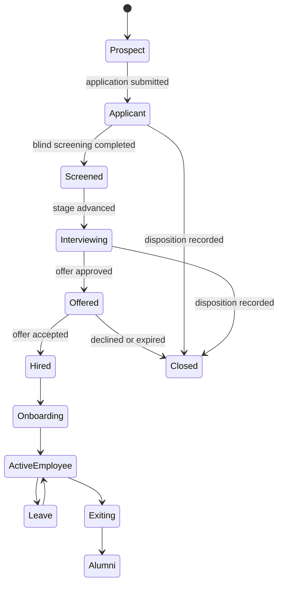
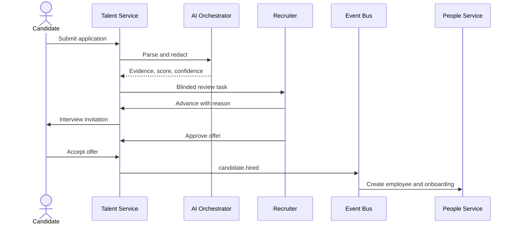
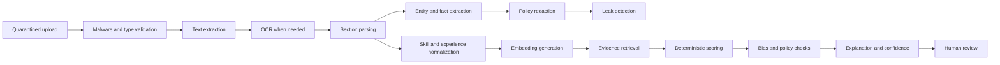
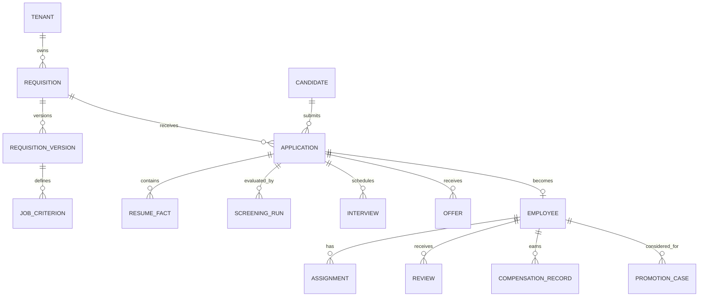
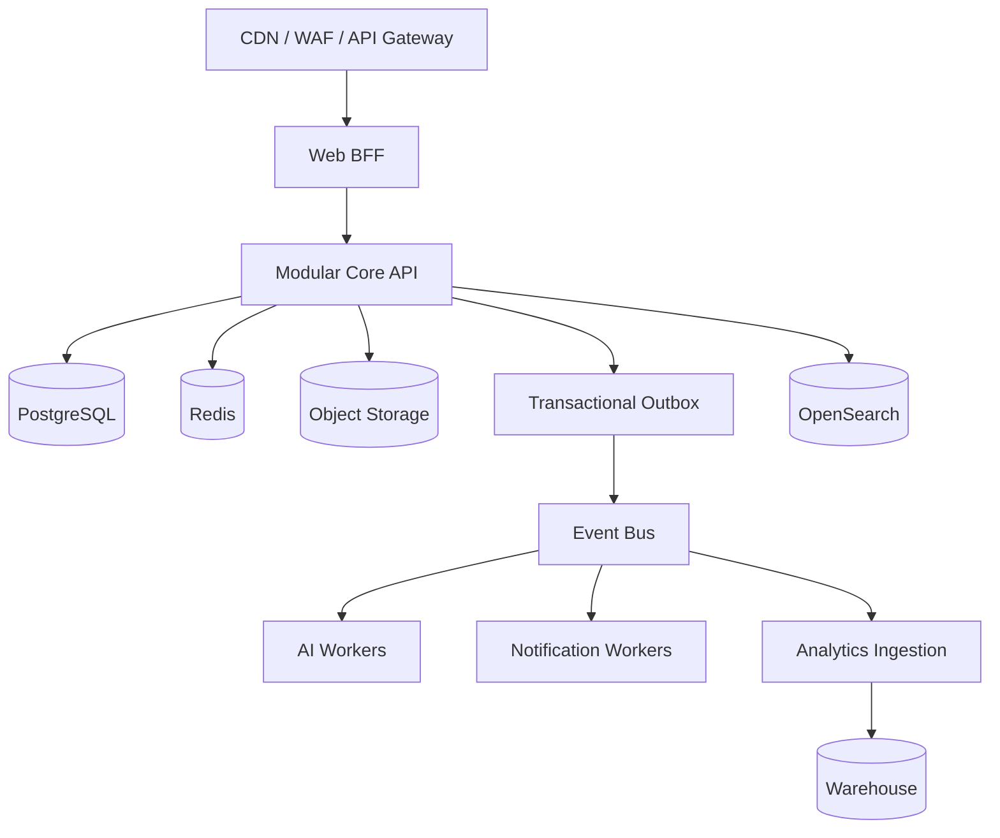

# FairLens — Complete Software Architecture & Development Specification

**Document status:** Draft for engineering review  
**Product:** FairLens  
**Tagline:** AI Powered Fair Hiring & Workplace Equity Platform  
**Audience:** Product, design, engineering, data science, security, legal, and compliance  
**Normative language:** “Must” is required; “should” is recommended; “may” is optional.

---

# 1 Executive Summary

FairLens is a multi-tenant system of record and decision-support platform for fair hiring and workplace equity.
It connects requisition creation, applications, screening, interviews, offers, onboarding, employment, reviews, promotions, compensation, reporting, compliance, and exits.
Every lifecycle event contributes to a longitudinal evidence graph.
That graph supports workflow automation, analytics, auditability, and fairness measurement.
FairLens does not make autonomous employment decisions.
Authorized humans own all consequential decisions.
AI outputs are recommendations with confidence, provenance, limitations, and explanations.
Protected attributes are isolated from operational decision views.
They may be processed in a restricted analytics enclave when lawful and consented.
The platform is designed for regional policy configuration rather than a single legal regime.

## 1.1 Product principles

- One canonical person lifecycle with role-specific views.
- Evidence before recommendation.
- Human review before consequential action.
- Data minimization by default.
- Explicit purpose and retention for every sensitive field.
- Fairness measured at every decision boundary.
- Reproducible AI and analytics results.
- Immutable records for material decisions.
- Accessible, responsive, and keyboard-operable workflows.
- APIs and events are first-class integration surfaces.

## 1.2 Success measures

| Measure | Target |
|---|---:|
| Median application completion | under 8 minutes |
| Resume parse success for supported files | at least 98% |
| Screening explanation coverage | 100% |
| Consequential decisions with named owner | 100% |
| Audit event delivery | at least 99.99% |
| Core API availability | 99.9% monthly |
| P95 interactive API latency | under 400 ms |
| WCAG conformance | 2.2 AA |
| Critical tenant-isolation incidents | 0 |
| Fairness metrics reproducible from snapshots | 100% |

---

# 2 Problem Statement

Hiring and employee systems commonly fragment identity, decisions, evidence, and outcomes across an ATS, HRIS, spreadsheets, survey tools, and case-management products.
This fragmentation makes bias hard to detect and harder to correct.
Resume reviewers can see irrelevant identity signals.
Interview feedback is inconsistent.
Promotion and compensation decisions lack comparable evidence.
Employees may not trust reporting channels.
Auditors cannot reliably reconstruct why a decision occurred.
Analytics often compare invalid cohorts or disclose groups that are too small.
AI can amplify these problems when its inputs, versions, thresholds, and overrides are not recorded.

FairLens must provide a connected operating model in which:

- A job’s approved criteria drive screening and structured interviews.
- The hired candidate becomes an employee without losing consent lineage.
- Performance evidence informs, but does not dictate, promotion review.
- Compensation and promotion outcomes feed fairness monitoring.
- Reports and investigations remain separated from normal HR visibility.
- Every recommendation and decision can be reconstructed.
- Corrective actions are assigned, measured, and closed.

---

# 3 Goals

## 3.1 Product goals

1. Provide an end-to-end talent and equity workflow.
2. Reduce exposure to identity signals during early screening.
3. Standardize job-related candidate and employee evaluation.
4. Detect outcome disparities using statistically defensible cohorts.
5. Enable secure anonymous and identified workplace reporting.
6. Produce regulator- and auditor-ready evidence packages.
7. Integrate with existing identity, calendar, HRIS, payroll, and storage systems.
8. Give individuals meaningful access, correction, consent, and deletion controls.

## 3.2 Engineering goals

- Strong tenant isolation.
- Transactional consistency for workflow state.
- Event-driven propagation between bounded contexts.
- Idempotent external integrations.
- Versioned schemas, policies, rubrics, and models.
- Observable services with traceable decisions.
- Safe degradation when AI providers are unavailable.
- Regional data residency and configurable retention.

## 3.3 Non-goals

- Replacing legal advice.
- Inferring protected characteristics from names, photos, or behavior.
- Fully autonomous rejection, hiring, firing, promotion, or compensation.
- Covert employee surveillance.
- Emotion detection or personality inference from video.
- Publishing individual-level fairness data to unauthorized users.
- Guaranteeing regulatory compliance without organizational controls.

---

# 4 Vision

FairLens becomes the trusted evidence layer across the employee lifecycle.
Operational users complete daily work without switching between disconnected modules.
Candidates understand what is collected and how it is used.
Employees can see their own employment records and safely raise concerns.
Leaders see aggregate risks and accountable remediation plans.
Auditors receive reproducible evidence without unrestricted production access.

## 4.1 Lifecycle state model



---

# 5 Complete User Personas

## 5.1 Candidate

Needs an accessible application, status visibility, accommodation request path, consent controls, and data correction.
May view only their own applications, interviews, offers, messages, and privacy requests.
Must never see internal comparative rankings or other candidates.

## 5.2 Recruiter

Creates requisitions, manages pipelines, communicates with candidates, and coordinates interviews.
Sees anonymized profiles until the configured reveal gate.
Cannot alter approved scoring criteria after candidates are scored without reapproval and rescore.

## 5.3 Hiring Manager

Approves job criteria, reviews eligible profiles, participates in structured evaluation, and owns selection decisions.
Sees only assigned requisitions and job-relevant evidence.
Must provide a disposition reason for each final decision.

## 5.4 HR Partner

Manages employees, onboarding, performance cycles, promotions, compensation review, and corrective actions.
Access is restricted by organization scope.
Sensitive case content requires separate case privileges.

## 5.5 Department Head

Reviews headcount, talent, aggregate equity indicators, and remediation.
Cannot access small-cell demographic data or anonymous reporter identity.

## 5.6 Employee

Maintains profile data, completes onboarding and reviews, requests leave, views compensation history, and submits reports.
Can access only their own record unless separately assigned management duties.

## 5.7 Administrator

Configures tenant settings, integrations, roles, templates, retention, and policy mappings.
Cannot silently grant themselves case or protected-attribute access.

## 5.8 Super Administrator

Operates the control plane across tenants.
Production tenant-data access is just-in-time, approved, time-bound, and audited.

## 5.9 Auditor

Receives read-only access to approved evidence scopes.
Can verify hashes, model versions, approvals, and exports.
Cannot mutate workflow data.

## 5.10 Compliance Officer

Owns regulatory mappings, legal holds, investigations, impact assessments, and report certification.
May view protected analytics only where lawful and necessary.

---

# 6 End-to-End Hiring Workflow

## 6.1 Requisition and job creation

1. A requester selects position, department, location, employment type, and budget.
2. The system imports approved competency and compensation bands.
3. An inclusive-language analyzer flags unnecessary, exclusionary, or ambiguous phrases.
4. The requester defines required and preferred criteria with evidence rules.
5. HR, finance, and hiring approvers complete a configurable approval chain.
6. Approval creates an immutable criteria version.
7. Publishing distributes the job to configured channels.

Validation:

- Required criteria must be job-related and measurable.
- Salary range must be valid for the currency and jurisdiction.
- Preferred criteria cannot contribute more than the tenant policy limit.
- No demographic target may be encoded as a candidate-level ranking rule.

## 6.2 Application

1. Candidate opens a locale-aware job page.
2. Candidate reviews privacy notice and optional demographic survey separately.
3. Candidate uploads a resume or enters structured history.
4. Malware scanning and file-type verification run before parsing.
5. Candidate reviews parsed fields and corrects errors.
6. Submission creates an application and consent snapshot.
7. Duplicate detection offers account linking without silently merging records.

## 6.3 Parsing and blind screening

1. Text is extracted or sent through OCR.
2. The parser identifies sections and normalized facts.
3. A redaction engine removes configured identity signals.
4. A leak detector verifies redaction.
5. A human privacy reviewer handles low-confidence cases.
6. Recruiters receive the blinded view and a stable candidate alias.
7. Raw documents stay in a restricted vault.

## 6.4 Ranking and review

1. The approved criteria version is compiled into a scoring policy.
2. Deterministic rules score explicit requirements.
3. Semantic matching proposes evidence for human verification.
4. The system calculates score, confidence, missing evidence, and uncertainty.
5. Recruiters review evidence rather than a score alone.
6. Advancement or disposition requires a reason code.
7. Threshold changes create a new version and trigger affected rescoring.

## 6.5 Interviews

1. Recruiter selects a panel satisfying conflict and training rules.
2. Candidate provides availability and accommodation needs.
3. Calendar integration finds slots without exposing unrelated calendar details.
4. Interviewers receive structured rubrics immediately before the session.
5. Feedback remains hidden until each interviewer submits.
6. Late edits are versioned and require a reason.
7. AI may summarize notes but cannot invent evidence or decide the outcome.

## 6.6 Offer and hire

1. Hiring manager proposes a decision with supporting evidence.
2. The system checks policy, compensation band, and approval requirements.
3. HR prepares a versioned offer template.
4. Candidate signs using an integrated signature provider.
5. Acceptance emits `candidate.hired`.
6. The identity vault reveals the minimum necessary data.
7. An employee record is created with provenance back to the application.

## 6.7 Onboarding and employment

1. A policy-based checklist is assigned by role and location.
2. Provisioning tasks flow to IT, payroll, facilities, and the manager.
3. Documents are signed and retained by classification.
4. Goals, reviews, learning, compensation, and promotion events attach to the employee timeline.
5. Equity services consume de-identified outcome events.

## 6.8 Exit

1. HR records separation type, effective date, and lawful reason.
2. Access deprovisioning and final-pay tasks are scheduled.
3. Exit feedback is collected with confidentiality controls.
4. Retention and legal-hold rules are recalculated.
5. Aggregate attrition analytics update after privacy thresholds are satisfied.



---

# 7 Product Modules

| Module | Responsibility | Primary integrations |
|---|---|---|
| Identity | Login, SSO, MFA, sessions | OIDC, SAML, SCIM |
| Authorization | RBAC, ABAC, delegated scopes | all services |
| Organizations | tenants, legal entities, departments | HRIS |
| Jobs | requisitions, criteria, postings | job boards |
| Applications | candidate submissions and status | careers site |
| Documents | upload, scan, vault, retention | object storage |
| Resume Intelligence | parse, normalize, redact | AI orchestrator |
| Screening | evidence scoring and review | jobs, applications |
| Interviews | schedules, panels, rubrics | calendars, video |
| Offers | approvals, documents, signature | compensation, e-sign |
| Onboarding | templates, tasks, provisioning | ITSM, payroll |
| People | employee master and timeline | HRIS |
| Time and Leave | attendance and leave workflow | payroll |
| Performance | goals, reviews, calibration | notifications |
| Promotions | eligibility and decision workflow | performance |
| Compensation | bands, cycles, pay-equity checks | payroll |
| Learning | skills, courses, completion | LMS |
| Reporting | anonymous intake and cases | secure messaging |
| Analytics | metrics, cohorts, dashboards | warehouse |
| Fairness | disparity tests and alerts | analytics |
| Compliance | controls, evidence, legal holds | audit |
| Notifications | templates and delivery | email, SMS, push |
| Audit | append-only security and business events | SIEM |
| Administration | policy and tenant configuration | all services |

## 7.1 Integration rule

Modules exchange immutable domain events.
Consumers must be idempotent.
The source module remains authoritative for its aggregate.
Cross-module reads use APIs or materialized read models, never shared-table writes.

---

# 8 Feature Breakdown

## 8.1 Authentication and RBAC

**Purpose:** Establish user identity and least-privilege access.  
**Inputs:** credentials, SSO assertion, MFA proof, tenant context.  
**Outputs:** rotating session, access token, effective permissions.  
**Validation:** issuer, audience, signature, nonce, tenant membership, account state.  
**Permissions:** public for initiation; authenticated for session management; admin for assignments.  
**Flow:** authenticate, resolve tenant, enforce MFA, issue session, audit success or failure.  
**Business logic:** deny by default; combine role, resource scope, relationship, purpose, and risk.  
**UI:** login, SSO selector, MFA challenge, sessions list, role editor.  
**Tables:** `users`, `identities`, `sessions`, `roles`, `permissions`, `role_bindings`.  
**API:** `POST /v1/auth/login`, `POST /v1/auth/refresh`, `DELETE /v1/auth/sessions/{id}`.  
**Edge cases:** disabled IdP, user in multiple tenants, clock skew, revoked assignment, recovery-code replay.

## 8.2 Job management

**Purpose:** Create an approved source of truth for job requirements.  
**Inputs:** job metadata, criteria, rubric, salary band, approvers.  
**Outputs:** requisition version, posting, screening policy.  
**Validation:** dates, jurisdiction, band, criteria weights, duplicate requisition.  
**Permissions:** requester creates; finance/HR/hiring manager approve by scope.  
**Flow:** draft, analyze language, review, approve, publish, pause, close.  
**Business logic:** published criteria are immutable; edits create a version.  
**UI:** wizard, language suggestions, criteria matrix, approval timeline.  
**Tables:** `requisitions`, `requisition_versions`, `job_criteria`, `job_postings`.  
**API:** `POST /v1/requisitions`, `POST /v1/requisitions/{id}/approve`.  
**Edge cases:** expired posting, withdrawn approval, currency change, headcount cancellation.

## 8.3 Resume parsing

**Purpose:** Turn candidate-controlled documents into reviewable evidence.  
**Inputs:** PDF, DOCX, RTF, TXT, or supported image.  
**Outputs:** normalized sections, facts, confidence, warnings.  
**Validation:** MIME signature, size, page count, malware result, encryption state.  
**Permissions:** candidate uploads; restricted processors access raw files.  
**Flow:** quarantine, scan, extract, OCR, parse, normalize, candidate correction.  
**Business logic:** extracted facts retain source spans and parser version.  
**UI:** upload zone, progress, side-by-side correction, confidence flags.  
**Tables:** `documents`, `document_versions`, `parse_jobs`, `resume_facts`.  
**API:** `POST /v1/applications/{id}/documents`, `GET /v1/parse-jobs/{id}`.  
**Edge cases:** image-only PDF, tables, multilingual resume, corrupt file, unsupported font.

## 8.4 Blind screening

**Purpose:** Suppress irrelevant identity signals before early review.  
**Inputs:** parsed facts, raw spans, tenant redaction policy.  
**Outputs:** redacted document, alias, leak score, review status.  
**Validation:** every redaction maps to a source span and policy rule.  
**Permissions:** reviewers see redacted view; privacy officers may reveal with reason.  
**Flow:** detect, redact, reconstruct, leak-check, manually verify when uncertain.  
**Business logic:** original and redacted files use separate keys and access policies.  
**UI:** blinded viewer, category counters, privacy-review queue.  
**Tables:** `redaction_policies`, `redaction_runs`, `redaction_spans`, `reveal_events`.  
**API:** `POST /v1/documents/{id}/redact`, `POST /v1/applications/{id}/reveal`.  
**Edge cases:** identity embedded in project name, portfolio URL, metadata, letterhead, OCR miss.

## 8.5 Candidate ranking

**Purpose:** Prioritize job-related evidence without autonomous decisions.  
**Inputs:** immutable criteria, verified facts, semantic evidence, policy weights.  
**Outputs:** score breakdown, confidence, gaps, explanation.  
**Validation:** weights total 100; prohibited features excluded; model is approved.  
**Permissions:** assigned talent users; candidates receive only permitted explanations.  
**Flow:** compile policy, retrieve evidence, score, review, record override.  
**Business logic:** missing data is unknown, not zero, unless criterion explicitly requires it.  
**UI:** ranked list, evidence drawer, weight inspector, override modal.  
**Tables:** `screening_policies`, `screening_runs`, `criterion_scores`, `overrides`.  
**API:** `POST /v1/requisitions/{id}/screen`, `GET /v1/applications/{id}/score`.  
**Edge cases:** tied scores, incomplete parse, changed criteria, model outage, conflicting evidence.

## 8.6 Interview management

**Purpose:** Coordinate structured, consistent assessment.  
**Inputs:** stages, panel, availability, rubric, accommodation.  
**Outputs:** calendar events, feedback, consolidated evidence.  
**Validation:** trained panel, no conflict, valid time zone, rubric completeness.  
**Permissions:** recruiter schedules; assigned interviewer scores; manager decides.  
**Flow:** propose, confirm, remind, conduct, submit locked feedback, debrief.  
**Business logic:** feedback is hidden until submission to reduce conformity bias.  
**UI:** scheduling grid, interview kit, rubric, debrief view.  
**Tables:** `interview_plans`, `interviews`, `panelists`, `feedback_forms`.  
**API:** `POST /v1/interviews`, `POST /v1/interviews/{id}/feedback`.  
**Edge cases:** cancellation, daylight saving, interviewer absence, accommodation privacy.

## 8.7 Offers and onboarding

**Purpose:** Convert an approved selection into a compliant employment start.  
**Inputs:** candidate, band, proposed package, template, start date.  
**Outputs:** approved offer, signature state, employee record, tasks.  
**Validation:** band range, approvers, template jurisdiction, duplicate active offer.  
**Permissions:** recruiter drafts; HR/finance approve; candidate signs.  
**Flow:** draft, equity check, approve, send, negotiate, accept, onboard.  
**Business logic:** out-of-band offers require explicit exception approval.  
**UI:** package builder, approval trace, document preview, checklist.  
**Tables:** `offers`, `offer_versions`, `offer_approvals`, `onboarding_plans`, `tasks`.  
**API:** `POST /v1/applications/{id}/offers`, `POST /v1/offers/{id}/accept`.  
**Edge cases:** expired offer, changed start date, rehire, failed signature callback.

## 8.8 Employee management

**Purpose:** Maintain a governed employment record and lifecycle timeline.  
**Inputs:** personal data, assignment, manager, location, status changes.  
**Outputs:** employee profile, assignments, events, downstream updates.  
**Validation:** effective dates, manager cycles, legal entity, worker identifier uniqueness.  
**Permissions:** employee self-view; HR scoped edit; manager limited team view.  
**Flow:** create, verify, update with effective dating, terminate, retain.  
**Business logic:** historical rows are closed, never overwritten.  
**UI:** profile, timeline, org chart, document center.  
**Tables:** `employees`, `employment_periods`, `assignments`, `employee_events`.  
**API:** `GET /v1/employees/{id}`, `PATCH /v1/employees/{id}`.  
**Edge cases:** concurrent jobs, dotted-line manager, international transfer, rehire.

## 8.9 Performance and promotion

**Purpose:** standardize feedback and make advancement evidence reviewable.  
**Inputs:** goals, feedback, ratings, competencies, eligibility rules.  
**Outputs:** review record, calibration result, promotion case, decision.  
**Validation:** cycle membership, required reviewers, rating range, conflict checks.  
**Permissions:** employee, manager, calibrator, and HR each see purpose-limited views.  
**Flow:** launch, self-review, manager review, calibration, acknowledge, promotion review.  
**Business logic:** AI summaries cite submitted evidence; no inferred personality traits.  
**UI:** goal tracker, review form, calibration matrix, promotion dossier.  
**Tables:** `review_cycles`, `reviews`, `goals`, `promotion_cases`, `promotion_decisions`.  
**API:** `POST /v1/review-cycles`, `POST /v1/promotion-cases/{id}/decide`.  
**Edge cases:** manager changes, leave during cycle, appeal, missing review, retroactive promotion.

## 8.10 Compensation and pay equity

**Purpose:** manage compensation changes and identify unexplained disparities.  
**Inputs:** salary, currency, band, job level, location, tenure, lawful cohort dimensions.  
**Outputs:** comp statements, regression diagnostics, alerts, remediation tasks.  
**Validation:** effective dates, currency, band overlap, minimum cohort.  
**Permissions:** employee self-view; compensation team restricted access; leader aggregates.  
**Flow:** ingest, normalize, compare, review drivers, approve adjustments, monitor.  
**Business logic:** analyses show adjusted and unadjusted gaps with uncertainty.  
**UI:** band distribution, cohort builder, diagnostic table, action plan.  
**Tables:** `compensation_records`, `pay_bands`, `comp_cycles`, `equity_analyses`.  
**API:** `POST /v1/compensation/analyses`, `GET /v1/compensation/analyses/{id}`.  
**Edge cases:** sparse cohort, multiple currencies, bonuses, part-time FTE, stale job level.

## 8.11 Anonymous reporting

**Purpose:** provide a safe channel for concerns and evidence.  
**Inputs:** category, narrative, evidence, preferred communication method.  
**Outputs:** anonymous receipt, secure mailbox, case, investigation actions.  
**Validation:** malware scan, content limits, rate controls, jurisdictional notice.  
**Permissions:** intake and investigators are separated; ordinary HR has no access.  
**Flow:** submit, receive recovery code, triage, communicate, investigate, close, appeal.  
**Business logic:** identity is not required; network metadata is minimized and short-lived.  
**UI:** safe-exit intake, secure mailbox, investigator workspace, evidence ledger.  
**Tables:** `reports`, `report_mailboxes`, `case_assignments`, `case_evidence`, `case_actions`.  
**API:** `POST /v1/public/reports`, `POST /v1/public/reports/{receipt}/messages`.  
**Edge cases:** lost recovery code, imminent harm, duplicate report, malicious file, conflict.

## 8.12 Compliance, analytics, and audit

**Purpose:** measure controls and produce reproducible evidence.  
**Inputs:** domain events, policy mappings, cohort definitions, model snapshots.  
**Outputs:** dashboards, alerts, reports, evidence packages.  
**Validation:** data freshness, cohort size, metric definition, certification scope.  
**Permissions:** aggregate by default; row-level access requires explicit purpose.  
**Flow:** ingest, validate, compute, suppress, review, certify, export.  
**Business logic:** all exports include timestamp, filters, source versions, and checksum.  
**UI:** control matrix, dashboard, report builder, audit explorer.  
**Tables:** `metric_definitions`, `metric_runs`, `alerts`, `controls`, `evidence_packages`.  
**API:** `POST /v1/analytics/queries`, `POST /v1/compliance/evidence-packages`.  
**Edge cases:** late events, deleted subjects, definition change, tiny cells, timezone cutoff.

---

# 9 Complete UI

## 9.1 Global shell

Desktop uses a collapsible left navigation, top command bar, context breadcrumbs, content canvas, and optional inspector drawer.
Mobile uses bottom navigation for primary destinations and a full-screen menu for secondary tools.
Every page provides skip navigation, visible focus, semantic landmarks, and a single H1.
Unsaved work is recovered from an encrypted draft when appropriate.

```text
+----------------+--------------------------------------------------+
| FairLens       | Search     Organization        Help   Alerts  Me |
| Overview       +--------------------------------------------------+
| Hiring         | Breadcrumbs                                      |
| People         | Page title                      Primary action    |
| Equity         | Filters / scope / date range                     |
| Reports        | +----------------+ +---------------------------+ |
| Compliance     | | KPI / status   | | Main chart or work queue  | |
| Admin          | +----------------+ +---------------------------+ |
|                | | Table / timeline / detail                      | |
+----------------+--------------------------------------------------+
```

## 9.2 Landing and careers pages

Purpose: explain the platform and host accessible job discovery.
Sections: navigation, search, values, open roles, privacy, accessibility, footer.
Filters: team, location, work model, level, employment type.
Empty state: “No matching roles” with clear-filters action.
Loading: skeleton job rows that preserve layout.
Error: retry plus alternate contact route.
Responsive: filters become a modal sheet below 768 px.

## 9.3 Login, signup, and recovery

Purpose: securely establish an account or federated session.
Sections: tenant branding, SSO, email login, MFA, privacy links.
Buttons: continue with SSO, sign in, use recovery code.
Validation is inline and summarized at form start.
Errors do not reveal whether an email exists.
Passkeys should be offered where supported.

## 9.4 Candidate dashboard

Sections: application status, next action, interview schedule, messages, documents, privacy controls.
Cards: active applications, pending forms, upcoming interviews.
Timeline uses plain-language states and dates.
The demographic survey is separate, optional where permitted, and never shown as a completion blocker.
Candidate may request correction, export, withdrawal, or deletion.

## 9.5 Recruiter dashboard

Sections: assigned requisitions, pipeline health, aging tasks, interview coordination, alerts.
Charts: stage conversion and time-in-stage; demographic data excluded from individual view.
Filters: owner, department, location, status, posting age.
Tables support column settings, saved views, bulk actions, and export permissions.
Empty state links to create a requisition.

## 9.6 Hiring manager dashboard

Sections: approvals, blinded candidates, interview packets, decisions, onboarding progress.
Cards prioritize overdue approvals and unsubmitted feedback.
Score breakdown always appears beside source evidence and confidence.
Buttons require confirmation for disposition and offer approval.

## 9.7 HR dashboard

Sections: workforce summary, lifecycle changes, equity alerts, review cycles, case workload.
Charts: headcount, hiring funnel, representation, attrition, promotion, compensation.
Filters: effective date, legal entity, department, location, level.
Small cohorts are suppressed and explained.
Alert cards link to a diagnostic view and accountable action plan.

## 9.8 Employee dashboard

Sections: profile, tasks, pay documents, leave, goals, reviews, learning, reporting.
Cards show next action without exposing sensitive manager-only content.
Anonymous reporting launches in a privacy-preserving context.
Profile changes display approval status and effective date.

## 9.9 Admin dashboard

Sections: users, roles, organization, integrations, policies, retention, model registry, audit.
Dangerous settings require reauthentication and a change reason.
Policy editors support draft, compare, approval, simulation, and scheduled activation.
Integration health shows last success, failures, lag, and replay controls.

## 9.10 Analytics and reports

The cohort builder exposes included population, exclusions, time basis, and minimum size.
Every visualization offers a data table and downloadable accessible alternative.
Chart tooltips are keyboard accessible.
Report exports show definition version and freshness.
Loading uses cancellable jobs for expensive analyses.

## 9.11 Settings and profile

Users control locale, timezone, notification channels, accessibility preferences, sessions, and privacy requests.
Tenant administrators control branding and defaults separately.
Profile fields show source-of-truth and whether local editing is allowed.

## 9.12 Standard states

| State | Requirement |
|---|---|
| Loading | Preserve layout; announce completion politely |
| Empty | Explain why and offer one relevant action |
| Error | State impact, recovery action, and support correlation ID |
| Offline | Preserve safe drafts and prevent false success |
| Forbidden | Explain missing scope without leaking resource existence |
| Stale | Show last update and refresh action |

---

# 10 Design System

## 10.1 Tokens

```css
:root {
  --color-brand-600: #3157d5;
  --color-brand-700: #2845ab;
  --color-surface: #ffffff;
  --color-canvas: #f6f7fb;
  --color-text: #172033;
  --color-muted: #5d6678;
  --color-success: #16794c;
  --color-warning: #9a6700;
  --color-danger: #b42318;
  --space-1: 0.25rem;
  --space-2: 0.5rem;
  --space-3: 0.75rem;
  --space-4: 1rem;
  --space-6: 1.5rem;
  --space-8: 2rem;
  --radius-sm: 0.375rem;
  --radius-md: 0.625rem;
  --shadow-card: 0 1px 3px rgb(17 24 39 / 12%);
}
```

Typography uses a system sans stack and a 1.5 base line-height.
Body text is at least 16 px.
Layout uses a 12-column grid with 24 px gutters on desktop.
Color never carries meaning alone.
Dark mode uses semantic token overrides, not per-component colors.
Charts use colorblind-safe palettes, patterns, direct labels, and tabular equivalents.
Motion respects `prefers-reduced-motion`.
Touch targets are at least 44 by 44 CSS pixels.
Dates are localized while storage and APIs use ISO 8601 UTC instants.

---

# 11 Component Library

| Component | Required behavior |
|---|---|
| `AppShell` | responsive navigation, landmarks, focus restoration |
| `Button` | variants, busy state, icon label, disabled reason |
| `TextField` | visible label, hint, validation, autocomplete |
| `Select` | searchable accessible listbox; native fallback |
| `DataTable` | sort, filter, pagination, column controls, keyboard access |
| `StatusBadge` | text plus semantic icon, never color only |
| `Avatar` | initials fallback and privacy-safe loading |
| `Timeline` | actor, event, effective time, recorded time |
| `FileUpload` | type/size help, scan progress, remove/retry |
| `EvidenceCard` | claim, source span, confidence, model version |
| `AIInsight` | recommendation, rationale, limitations, feedback control |
| `MetricCard` | value, definition, period, comparison, freshness |
| `ChartFrame` | title, description, legend, table, export |
| `CohortBuilder` | dimensions, exclusions, preview size, suppression warning |
| `ApprovalPanel` | current step, approvers, history, decision reason |
| `SecureMailbox` | pseudonymous messages and evidence attachments |
| `AuditTimeline` | immutable event metadata and integrity status |
| `ConfirmDialog` | consequence, affected records, typed confirmation when high-risk |
| `Toast` | transient confirmation only; errors remain in context |
| `Skeleton` | mirrors content geometry and has no focusable controls |

Components are documented in Storybook.
Each component has interaction, accessibility, visual regression, and localization tests.

---

# 12 AI Architecture

## 12.1 Pipeline



## 12.2 Model strategy

Use deterministic parsers for dates, contact fields, and exact taxonomies where possible.
Use layout-aware document models for section and span extraction.
Use multilingual NER for identity and organization entities.
Use a tenant-approved embedding model for semantic retrieval.
Use an LLM only for constrained extraction or summarization with schema validation and cited source spans.
No generative model output becomes a fact without provenance.

Candidate model families:

- OCR: managed document OCR for high accuracy; Tesseract as an offline fallback.
- Layout parsing: LayoutLM-family or managed document intelligence.
- NER: fine-tuned DeBERTa or spaCy pipelines.
- Embeddings: multilingual E5 or an approved managed embedding model.
- Explanations: template-first; grounded LLM summaries when enabled.

Selection criteria include accuracy by language and document type, latency, residency, cost, explainability, license, and subgroup error analysis.

## 12.3 Orchestration

Each AI job records:

- input artifact hashes;
- prompt and template version;
- model provider, name, and immutable version;
- decoding and threshold configuration;
- taxonomy and policy versions;
- raw structured result;
- validation findings;
- confidence and abstention reason;
- human corrections;
- runtime, cost, and region.

The orchestrator retries transient failures with exponential backoff.
It does not retry deterministic validation failures.
Circuit breakers route to a fallback or human queue.
Constrained outputs use JSON Schema.
Prompt inputs are stripped of unnecessary PII.
Provider training and retention must be contractually disabled.

## 12.4 Human oversight

The system abstains when confidence is below a task-specific threshold.
Reviewers can accept, correct, or reject extracted evidence.
Overrides require a reason and are monitored for systematic patterns.
Automation never sends a final adverse employment decision.
Candidates and employees receive an appropriate contestability channel.

## 12.5 Evaluation

Offline datasets are consented, de-identified, documented, and split to prevent leakage.
Parsing is measured with field precision, recall, span F1, and correction rate.
Ranking is measured with retrieval quality and calibrated human relevance, not historical hiring alone.
Redaction is optimized for protected-signal recall while tracking destructive over-redaction.
Evaluation slices include language, format, career length, assistive formatting, and geography.
Deployment requires model-card approval and regression gates.
Production monitoring detects drift, latency, failure, correction, override, and subgroup error changes.

---

# 13 Resume Parser

Supported inputs are PDF, PDF/A, DOCX, RTF, TXT, PNG, JPEG, and TIFF.
The default limit is 10 MB and 30 pages, tenant-configurable within platform limits.
Encrypted documents return a recoverable error.
File extensions are not trusted.
Embedded scripts and active content are rejected.

The parser creates:

- contact facts in the restricted identity domain;
- summary;
- employment entries;
- education entries;
- projects;
- skills linked to taxonomy identifiers;
- certifications and expiration dates;
- languages;
- publications and volunteering;
- source spans and confidence for every fact.

Normalized facts preserve original text.
Date intervals support month precision and an “ongoing” state.
Overlapping positions are not automatically summed.
Skills inferred solely from job titles are labeled inferred and excluded from required-skill scoring until verified.
Candidate corrections create a new fact version and feed evaluation, not automatic training.

---

# 14 Blind Screening Engine

Redaction categories include name, pronouns, title, photo, date of birth, age, address, phone, email, social links, personal websites, and configured organizations.
University removal is policy-configurable because education evidence may be legitimately required while prestige is not.
Religion and ethnicity indicators are redacted only from explicit text; FairLens must not infer either category.
The engine removes document metadata, comments, tracked changes, headers, footers, images, QR codes, hyperlinks, and hidden text where policy requires.

Redacted documents are reconstructed rather than painted over.
Text beneath a visual rectangle must not remain extractable.
The leak checker performs text, metadata, image, and named-entity scans.
A low leak confidence blocks reviewer release.
A privacy officer may reveal a category only after the configured hiring stage.
Every reveal records actor, reason, scope, and timestamp.

---

# 15 ATS Engine

## 15.1 Default scoring

```text
eligible =
  all legally valid mandatory requirements satisfied

raw_score =
  0.40 * technical_skill_match +
  0.15 * job_related_experience +
  0.15 * project_evidence +
  0.10 * job_related_education_or_equivalent +
  0.10 * structured_soft_skill_evidence +
  0.10 * preferred_criteria

confidence =
  weighted_mean(source_confidence, evidence_coverage)
```

Weights are job-specific but bounded by tenant policy.
Years of experience are not used when a demonstrated-equivalence rule applies.
Keyword repetition does not increase a score.
Semantic matches must cite evidence and taxonomy mappings.
Missing preferred evidence produces a gap, not an unsupported negative conclusion.
Mandatory failures are surfaced individually and are always reviewable.
Recommendations distinguish “advance for review,” “needs evidence,” and “not eligible.”

---

# 16 Candidate Ranking

Embeddings retrieve relevant resume spans for each criterion.
Deterministic functions score verified evidence against the approved rubric.
The final view defaults to bands rather than false precision.
Tie-breaking uses, in order:

1. higher mandatory-criteria coverage;
2. higher evidence confidence;
3. fewer unresolved facts;
4. structured human review;
5. stable randomized order if still tied.

Application time is not a merit tie-breaker.
Protected attributes, proxies, names, photos, address precision, and school prestige are prohibited features.
Explanations show criteria, weight, evidence, gap, confidence, and policy version.
Counterfactual explanations may identify job-related missing evidence but never suggest changing identity.

---

# 17 Interview Module

Interview plans consist of stages, competencies, questions, anchors, panel requirements, and decision rules.
Question banks are versioned and reviewed for legality, accessibility, and job relevance.
Interviewers receive bias-awareness training status checks.
Candidate accommodations are disclosed only to coordinators who need them.
Notes must distinguish observation from judgment.
Feedback forms require evidence before rating submission.
AI summaries quote or cite notes and identify disagreement.
Sentiment, emotion, accent, facial expression, and gaze analysis are prohibited.

---

# 18 Employee Lifecycle

## 18.1 Onboarding

Templates vary by legal entity, worker type, location, and role.
Tasks have owner, due date, dependency, evidence, and escalation.
Failed downstream provisioning remains visible until reconciled.

## 18.2 Attendance and leave

FairLens stores only data necessary for configured processes.
Health documentation is isolated.
Managers see operational availability, not diagnosis.
Leave eligibility is policy-versioned and effective-dated.

## 18.3 Performance

Goals require measurable outcomes and update history.
Continuous feedback is visible according to declared audience.
Calibration changes preserve original rating and rationale.

## 18.4 Promotion

Eligibility rules are transparent and versioned.
Cases compare job-related evidence within valid cohorts.
Human committees record recusal, decision, reason, and appeal.

## 18.5 Training and recognition

Learning recommendations may use verified skill gaps.
Access to development opportunities is measured by cohort.
Recognition text is scanned for biased descriptors but remains human-owned.

## 18.6 Exit

Voluntary, involuntary, retirement, end-of-contract, and transfer are distinct.
Access removal tasks are driven by effective time.
Exit analytics suppress identifiable narratives.

---

# 19 HR Analytics

| Metric | Definition |
|---|---|
| Hiring funnel | distinct applications entering each stage in period |
| Selection rate | selected divided by eligible considered population |
| Time to fill | requisition approval to accepted offer |
| Time to hire | application submission to accepted offer |
| Representation | active headcount in group divided by valid known population |
| Promotion rate | promoted eligible employees divided by eligible employees |
| Attrition rate | separations divided by average active headcount |
| Retention rate | starting cohort remaining after period divided by starting cohort |
| Leadership representation | group leaders divided by leaders with known data |
| Pay gap | difference in mean or median normalized compensation |
| Review distribution | rating counts by cycle and valid cohort |

All metrics define event time, effective time, denominator, exclusions, unknown handling, and version.
Dashboards show data freshness and source health.
Drill-down stops when privacy thresholds would be violated.
Exports use the viewer’s row and column policy.

---

# 20 Fairness Analytics

## 20.1 Demographic parity difference

```text
DPD = P(decision = positive | group A) - P(decision = positive | reference)
```

Use as an outcome disparity indicator, not proof of unlawful bias.

## 20.2 Disparate impact ratio

```text
DIR = selection_rate(group A) / selection_rate(reference)
```

The four-fifths heuristic may be displayed where applicable but is not a universal legal conclusion.

## 20.3 Equal opportunity difference

```text
EOD = TPR(group A) - TPR(reference)
TPR = qualified positives selected / qualified positives
```

This requires a defensible, outcome-independent qualification label.

## 20.4 Pay equity

Report unadjusted mean and median gaps.
For diagnostic adjustment, use an approved regression with job level, location, tenure, role family, FTE, and other lawful factors.
Publish coefficient estimates, confidence intervals, residual diagnostics, sample size, missingness, and sensitivity checks.

## 20.5 Promotion equity

Compare promotion rates within eligible job family and level cohorts.
Time-to-promotion uses survival analysis when censoring is material.

## 20.6 Review bias

Compare rating distributions, text descriptor frequencies, calibration changes, and manager effects.
Do not treat language-model sentiment as ground truth.

## 20.7 Statistical controls

- Minimum reportable cell size defaults to 10.
- Confidence intervals accompany point estimates.
- Multiple comparisons use an approved correction.
- Alerts require practical and statistical significance thresholds.
- Unknown demographic values remain explicit.
- Intersectional analysis is permitted only above privacy thresholds.
- Cohort definitions and metric code are versioned.
- Analysts must distinguish correlation, disparity, and causal claims.

---

# 21 Anonymous Reporting

Public report submission uses a dedicated origin and minimal telemetry.
The server generates a high-entropy report secret.
Only a slow hash is stored for mailbox authentication.
The reporter receives a human-readable recovery code once.
Report content is encrypted with a per-case data key.
That key is wrapped by a managed KMS key.
Evidence is hashed, malware-scanned, and stored immutably.
Downloads are watermarked and audited when supported.

Case states are `new`, `triaged`, `assigned`, `investigating`, `action_pending`, `closed`, and `appealed`.
Severity and urgency are separate.
Conflict checks prevent assignment to implicated people or reporting lines.
Emergency language presents jurisdiction-configured resources without pretending FairLens is an emergency service.
Moderation addresses threats, doxxing, and malicious uploads while preserving relevant evidence.
Retention starts from closure unless a legal hold applies.

---

# 22 Compliance

FairLens provides controls and evidence; the customer remains responsible for legal applicability.

## 22.1 Privacy

GDPR-oriented capabilities include lawful-basis records, purpose limitation, data-subject requests, consent withdrawal, processing records, transfer controls, minimization, and deletion workflows.
Automated-decision safeguards expose human review and contestability.
Sensitive data uses field-level classification and restricted purposes.

## 22.2 Employment reporting

EEOC-oriented exports use effective-dated job categories and validated demographic mappings.
Reports require an authorized certifier.
The system retains calculation inputs and mapping versions.

## 22.3 Security frameworks

SOC 2 evidence maps controls to ownership, frequency, tests, exceptions, and artifacts.
ISO 27001 mappings link risks, controls, policies, and treatment plans.
Evidence collection must avoid granting auditors unrestricted operational access.

## 22.4 Retention and legal hold

Retention is selected by record class, jurisdiction, purpose, and lifecycle state.
Deletion jobs create tombstones and proof without retaining deleted content.
Legal hold overrides deletion only for the scoped records.
Hold creation, amendment, release, and export are dual-controlled.

---

# 23 Database

PostgreSQL is the transactional system of record.
Object storage holds encrypted documents.
OpenSearch supports authorized full-text search.
Redis holds non-authoritative cache and coordination data.
A warehouse or lakehouse supports governed analytics.

## 23.1 Core tables

| Table | Key columns and relationships | Important indexes |
|---|---|---|
| `tenants` | `id`, name, region, status | status |
| `legal_entities` | tenant, country, name | tenant/country |
| `org_units` | tenant, parent, type | tenant/parent |
| `locations` | tenant, country, timezone | tenant/country |
| `users` | tenant, email hash, status | unique tenant/email hash |
| `identities` | user, provider, subject | unique provider/subject |
| `sessions` | user, token hash, expires | user/expires |
| `roles` | tenant, name, system flag | unique tenant/name |
| `permissions` | code, description | unique code |
| `role_permissions` | role, permission | unique pair |
| `role_bindings` | user, role, scope | user/scope |
| `consents` | subject, purpose, version, state | subject/purpose |
| `privacy_requests` | subject, type, state | tenant/state |
| `requisitions` | tenant, owner, state | tenant/state |
| `requisition_versions` | requisition, version, hash | unique requisition/version |
| `job_criteria` | version, type, weight, rubric | version/type |
| `job_postings` | version, channel, state | tenant/state |
| `candidates` | tenant, identity vault reference | tenant/created |
| `applications` | candidate, requisition, state | requisition/state |
| `application_events` | application, event, effective time | application/time |
| `documents` | tenant, owner type/id, classification | owner |
| `document_versions` | document, object key, hash | unique document/version |
| `parse_jobs` | document version, model run, state | state/created |
| `resume_facts` | application, type, normalized value | application/type |
| `redaction_policies` | tenant, version, state | tenant/state |
| `redaction_runs` | document version, policy, state | document version |
| `redaction_spans` | run, page, offsets, category | run/category |
| `reveal_events` | application, actor, category, reason | application/time |
| `screening_policies` | requisition version, version, hash | requisition version |
| `screening_runs` | application, policy, state, score | application/time |
| `criterion_scores` | run, criterion, score, confidence | run/criterion |
| `decision_overrides` | decision, actor, from/to, reason | decision/time |
| `pipeline_stages` | requisition, position, name | requisition/position |
| `interview_plans` | requisition version, version | requisition version |
| `interviews` | application, stage, start, status | application/start |
| `interview_panelists` | interview, user, role | interview/user |
| `feedback_forms` | interview, panelist, version, state | interview/state |
| `feedback_answers` | form, criterion, rating, evidence | form/criterion |
| `offers` | application, state, current version | application/state |
| `offer_versions` | offer, compensation, document | unique offer/version |
| `offer_approvals` | offer version, approver, state | offer version/state |
| `employees` | tenant, worker number, user | unique tenant/worker number |
| `employment_periods` | employee, start, end, type | employee/start |
| `assignments` | employee, org, manager, effective range | employee/effective |
| `onboarding_plans` | employee, template, state | employee/state |
| `tasks` | tenant, assignee, due, state | assignee/state/due |
| `leave_requests` | employee, type, dates, state | employee/state |
| `review_cycles` | tenant, period, state | tenant/state |
| `reviews` | cycle, subject, reviewer, state | cycle/subject |
| `goals` | employee, period, state | employee/period |
| `promotion_cases` | employee, target level, state | employee/state |
| `promotion_decisions` | case, outcome, reason | case |
| `pay_bands` | tenant, role, level, location, range | role/level/location |
| `compensation_records` | employee, components, effective range | employee/effective |
| `comp_cycles` | tenant, period, state | tenant/state |
| `learning_records` | employee, course, state | employee/state |
| `reports` | tenant, encrypted payload, state | tenant/state |
| `report_mailboxes` | report, secret hash | report |
| `cases` | report, severity, state | tenant/state |
| `case_assignments` | case, investigator, effective range | case/investigator |
| `case_evidence` | case, document, hash | case |
| `case_actions` | case, type, owner, due | case/state |
| `metric_definitions` | tenant, code, version, query hash | unique tenant/code/version |
| `metric_runs` | definition, period, state | definition/period |
| `fairness_alerts` | metric run, severity, state | tenant/state |
| `action_plans` | alert, owner, due, state | owner/state |
| `controls` | tenant, framework, code, owner | tenant/framework |
| `control_tests` | control, period, result | control/period |
| `legal_holds` | tenant, scope, state | tenant/state |
| `audit_events` | tenant, actor, action, resource, hash chain | tenant/time |
| `outbox_events` | aggregate, type, payload, published | published/created |
| `notifications` | recipient, channel, template, state | recipient/state |
| `integration_connections` | tenant, provider, encrypted config | tenant/provider |
| `integration_runs` | connection, cursor, state | connection/state |
| `model_registry` | task, model, version, approval | task/approval |
| `model_runs` | registry version, input hash, output hash | model/time |

Every tenant-owned table contains `tenant_id`.
Application code sets tenant context per transaction.
PostgreSQL row-level security provides defense in depth.
PII fields are encrypted with envelope encryption where search is unnecessary.
Searchable identifiers use keyed hashes with rotation support.
Effective-dated rows use non-overlap exclusion constraints.
Money uses integer minor units plus ISO 4217 currency.
Optimistic locking uses a `version` column.



---

# 24 API Design

APIs use JSON over HTTPS and `/v1`.
Identifiers are opaque UUIDv7 values.
Dates are `YYYY-MM-DD`; instants are RFC 3339 UTC.
List endpoints use cursor pagination.
Writes accept `Idempotency-Key`.
Updates require `If-Match`.
Errors use RFC 9457 problem details.

```http
POST /v1/requisitions/019.../screening-runs
Authorization: Bearer <token>
Idempotency-Key: 7cf...
Content-Type: application/json

{
  "application_ids": ["019..."],
  "policy_version": 3,
  "reason": "Initial blinded screening"
}
```

```json
{
  "data": {
    "id": "019...",
    "status": "queued",
    "policy_version": 3
  },
  "meta": {
    "request_id": "req_019..."
  }
}
```

```json
{
  "type": "https://api.fairlens.example/problems/version-conflict",
  "title": "Version conflict",
  "status": 409,
  "detail": "The requisition changed after it was loaded.",
  "instance": "/v1/requisitions/019...",
  "request_id": "req_019..."
}
```

Core routes:

- `/v1/requisitions`
- `/v1/jobs`
- `/v1/candidates/me`
- `/v1/applications`
- `/v1/documents`
- `/v1/screening-runs`
- `/v1/interviews`
- `/v1/offers`
- `/v1/employees`
- `/v1/review-cycles`
- `/v1/promotion-cases`
- `/v1/compensation`
- `/v1/reports`
- `/v1/cases`
- `/v1/analytics`
- `/v1/compliance`
- `/v1/admin`
- `/v1/audit-events`

Rate limits are keyed by tenant, actor, route risk, and source.
Anonymous report limits must resist abuse without making reporters easy to correlate.
Webhook signatures use timestamped HMAC.
Webhook delivery retries for 72 hours and exposes replay.
OpenAPI is the contract source.
Breaking changes require a new major version and migration window.

---

# 25 Backend Architecture

Begin with a modular monolith for transactional domains and separate asynchronous AI workers.
Extract services only when scaling, security isolation, release cadence, or ownership justifies operational cost.



Bounded contexts are identity, organization, talent, people, performance, compensation, reporting, compliance, and platform.
Commands mutate aggregates.
Queries use read models where cross-domain composition is necessary.
The outbox pattern prevents database/event dual-write loss.
Consumers store processed event IDs.
Long workflows use sagas with explicit compensation.

Redis caches permission resolutions, reference data, and short-lived query results.
Cache keys include tenant, policy version, and authorization scope.
Sensitive case bodies and raw demographic records are never placed in general cache.
Database transactions remain authoritative.

Workers handle document processing, AI inference, exports, notifications, imports, deletion, and metric computation.
Object keys are opaque and tenant-prefixed.
Downloads use short-lived signed URLs after authorization.
CDN serves only public or explicitly cacheable content.

---

# 26 Frontend Architecture

Use React, TypeScript, and Vite.
Use TanStack Query for server state.
Use React Hook Form and schema validation for forms.
Use a small local store only for ephemeral UI state.
Use design-system components rather than unreviewed page-local patterns.
Tailwind may implement tokens; shadcn primitives must be adapted for accessibility and branding.

```text
src/
  app/
    router/
    providers/
    layouts/
  features/
    applications/
    requisitions/
    screening/
    interviews/
    people/
    performance/
    compensation/
    reporting/
    analytics/
    compliance/
  components/
    ui/
    data-display/
    forms/
  services/
    api/
    auth/
    telemetry/
  hooks/
  schemas/
  styles/
  test/
```

Feature folders contain routes, components, hooks, schemas, and tests.
Generated API clients derive from OpenAPI.
Queries use stable key factories.
Mutations invalidate the narrowest relevant keys.
Route-level code splitting is mandatory.
Large charting and document-viewer packages load on demand.
Authorization hides unavailable actions but the API always enforces policy.
Errors flow to page boundaries with correlation IDs.

---

# 27 Security

## 27.1 Identity and sessions

Support OIDC, SAML, SCIM, passkeys, and TOTP.
Access tokens expire within 15 minutes.
Refresh tokens rotate and detect reuse.
Sensitive actions require recent authentication.
Administrative access requires phishing-resistant MFA where available.

## 27.2 Authorization

RBAC provides job functions.
ABAC constrains tenant, organization, assignment, case, purpose, and data classification.
Relationship rules govern manager and self-service access.
Policy decisions are centrally logged.
Object existence is not leaked on denied requests.

## 27.3 Data protection

TLS 1.2 or later protects transit.
Managed KMS protects envelope-encryption keys.
Key rotation and cryptographic erasure are supported.
Production secrets use a secrets manager.
Backups are encrypted, access-controlled, tested, and region-bound.

## 27.4 Application security

- Parameterized queries prevent injection.
- Contextual output encoding and CSP reduce XSS risk.
- SameSite cookies and anti-CSRF tokens protect cookie-authenticated writes.
- SSRF defenses use destination allowlists and network egress controls.
- Uploads are quarantined and scanned.
- Dependency and container scanning run in CI.
- SAST, secret scanning, and IaC scanning block critical findings.
- OWASP ASVS Level 2 is the baseline; higher-risk paths receive additional controls.

## 27.5 Audit

Material read, write, reveal, export, policy, model, and authorization events are audited.
Audit payloads exclude secrets and unnecessary content.
Events form a per-tenant hash chain and are exported to immutable storage.
Clock synchronization and actor provenance are monitored.

Threat models are required for identity, anonymous reporting, document upload, AI providers, exports, and multi-tenant analytics.

---

# 28 Notifications

Channels include in-app, email, SMS, and push where configured.
Templates are versioned by locale and jurisdiction.
Sensitive details are omitted from lock-screen and email previews.
Users control optional channels; mandatory legal or security notices are identified separately.
Delivery uses a queue with exponential retry, dead-letter handling, and provider failover.
Each notification has a deduplication key.
Quiet hours respect user timezone except urgent security events.
Bounces, complaints, and opt-outs update channel status.
Messages link to authenticated records instead of embedding confidential content.

---

# 29 Deployment

Containers run as non-root with read-only filesystems.
NGINX or the cloud ingress terminates TLS and applies request limits.
Kubernetes is optional; a managed container platform is preferred until scale justifies cluster operations.
Infrastructure is defined in Terraform.
Environments are development, preview, staging, and production.
Production data is never copied into lower environments without approved irreversible de-identification.

CI stages:

1. format and static analysis;
2. unit and component tests;
3. schema and contract compatibility;
4. security scans and SBOM;
5. integration tests;
6. build signed immutable images;
7. deploy preview;
8. accessibility and end-to-end tests;
9. approval and progressive production rollout;
10. smoke tests and automated rollback.

Deployments use canary or blue-green rollout.
Database migrations are backward-compatible expand-and-contract changes.
Feature flags separate deployment from release.
Region failures follow documented recovery procedures.
Target RPO is 15 minutes and RTO is 4 hours for the core platform.

Observability includes structured logs, RED metrics, distributed traces, queue depth, model performance, and business workflow health.
Logs carry request, tenant, actor pseudonym, and trace IDs without raw PII.
Alerts are actionable and linked to runbooks.
Synthetic tests cover login, application, screening, offer, reporting, and admin policy paths.

## 29.1 Performance

- Paginate every unbounded collection.
- Avoid N+1 queries through explicit loaders.
- Maintain query budgets for critical endpoints.
- Precompute authorized analytics aggregates.
- Stream large exports directly to object storage.
- Use resumable multipart upload.
- Virtualize tables above 200 rendered rows.
- Set frontend performance budgets.
- Run load tests at expected peak plus 50%.

---

# 30 Roadmap

## 30.1 MVP

- Tenant, identity, MFA, RBAC, and audit.
- Job and criteria approval.
- Candidate application and consent.
- Secure resume parsing and blind screening.
- Explainable candidate evidence scoring.
- Structured interviews and feedback.
- Offers and candidate-to-employee conversion.
- Basic employee records.
- Anonymous reporting with secure mailbox.
- Hiring, representation, promotion, and pay dashboards.
- CSV/JSON imports and exports.
- Policy, retention, and model registry foundations.

Exit criteria:

- Security threat models approved.
- WCAG 2.2 AA audit passes critical flows.
- AI evaluation meets signed thresholds.
- Tenant isolation tests pass.
- Disaster recovery exercise completes.
- No autonomous adverse decision path exists.

## 30.2 Version 2

- Calendar, HRIS, payroll, e-signature, and SCIM integrations.
- Onboarding, leave, goals, reviews, promotion, and compensation cycles.
- Advanced cohort builder and action plans.
- Data-subject request automation.
- Regional residency and multilingual UI.
- Model monitoring and controlled experimentation.

## 30.3 Enterprise

- Multiple legal entities and delegated administration.
- Customer-managed keys.
- Private networking and dedicated inference.
- Configurable compliance packs.
- Advanced legal holds and e-discovery export.
- Warehouse sharing and governed custom metrics.
- High-availability multi-region options.

## 30.4 Future AI features

- Grounded policy assistant with permission-aware retrieval.
- Skills ontology recommendations with human curation.
- Evidence-quality coaching for job and review authors.
- Scenario simulation for aggregate workforce plans.
- Privacy-preserving federated evaluation.

Future AI work remains subject to impact assessment, representative evaluation, human oversight, and regional law.

---

# Appendix A Domain Events

| Event | Producer | Key consumers |
|---|---|---|
| `requisition.approved` | Jobs | postings, screening, audit |
| `application.submitted` | Applications | documents, notifications, analytics |
| `resume.parsed` | Resume Intelligence | redaction, screening |
| `resume.redacted` | Resume Intelligence | talent workflow |
| `screening.completed` | Screening | tasks, analytics |
| `application.stage_changed` | Applications | notifications, fairness |
| `interview.feedback_submitted` | Interviews | decision read model |
| `offer.accepted` | Offers | people, onboarding |
| `employee.assignment_changed` | People | authorization, analytics |
| `review.completed` | Performance | promotion, analytics |
| `promotion.decided` | Promotions | people, compensation, fairness |
| `compensation.changed` | Compensation | payroll, fairness |
| `report.submitted` | Reporting | case intake |
| `case.closed` | Reporting | retention, aggregate analytics |
| `privacy.deletion_approved` | Privacy | all data owners |

Event envelopes include ID, type, schema version, tenant, aggregate, sequence, occurred time, recorded time, actor class, trace ID, and payload.
Consumers reject out-of-order aggregate sequences where ordering is required.
Schema evolution is backward-compatible within a major version.

---

# Appendix B Decision Record Requirements

Every consequential hiring, promotion, compensation, performance, investigation, and separation decision records:

- subject and resource identifiers;
- named accountable decision owner;
- decision type and outcome;
- effective and recorded timestamps;
- policy and rubric versions;
- evidence references;
- AI model runs consulted;
- human rationale;
- required approvals;
- overrides and recusals;
- appeal or correction route;
- audit-event references.

The decision record is immutable.
Corrections append superseding records.

---

# Appendix C Testing Strategy

Unit tests cover domain invariants, policy functions, scoring, and serializers.
Property tests cover money, dates, cohort suppression, and authorization boundaries.
Contract tests validate OpenAPI clients and event schemas.
Integration tests use real PostgreSQL, Redis, object storage emulator, and message broker.
End-to-end tests cover each persona’s critical journey.
Accessibility tests combine automated checks with keyboard and assistive-technology review.
Security tests include tenant-boundary, IDOR, upload, SSRF, session, and privilege-escalation cases.
AI tests use immutable evaluation sets and adversarial documents.
Fairness metric tests use synthetic populations with known expected results.
Migration tests run from every supported release.
Chaos tests exercise provider failure, delayed events, duplicate delivery, and region degradation.

Release gates:

- zero critical security findings;
- zero known cross-tenant access defects;
- no accessibility blocker in a critical journey;
- API and event compatibility passes;
- migration rollback or forward-fix procedure is rehearsed;
- model and policy approvals are present;
- operational dashboards and runbooks exist.

---

# Appendix D Development Notes

Use UTC internally and preserve user timezone separately.
Never use floating point for money.
Never mutate historical effective-dated facts.
Never train directly from production corrections without review and consent.
Never log resume text, report narratives, tokens, or credentials.
Never expose protected attributes in candidate ranking APIs.
Never encode authorization solely in the client.
Never reuse analytics extracts for a new purpose without governance review.
Prefer explicit workflow states over boolean combinations.
Prefer append-only decision and audit records.
Require idempotency for imports, webhooks, commands, and workers.
Document every background job’s retry and poison-message behavior.
Version prompts, schemas, taxonomies, criteria, metrics, and policies.
Make unknown, not applicable, withheld, and missing distinct values.
Provide data provenance in operational and analytics views.
Treat accessibility, privacy, security, and explainability as acceptance criteria.

---

# Appendix E Acceptance Checklist

## Product

- All lifecycle stages share stable, governed identities.
- Every transition has an owner, permission, validation, and audit event.
- Candidates can review parsed data and exercise privacy rights.
- Recruiters cannot access configured identity fields before reveal.
- Human owners approve every consequential decision.
- Employees can see their own records and safely report concerns.
- Leaders receive aggregates with small-cell protection.

## Engineering

- Tenant isolation is enforced and penetration-tested.
- Transactional outbox and idempotent consumers are implemented.
- APIs are documented and compatibility-tested.
- Background work is observable and recoverable.
- Sensitive fields, documents, and backups are encrypted.
- Retention, deletion, and legal hold are testable.
- Critical flows meet latency and availability objectives.

## AI and analytics

- Model inputs exclude prohibited attributes and unnecessary PII.
- Outputs include evidence, confidence, and version.
- Low-confidence results abstain or enter human review.
- Evaluation covers relevant languages and document formats.
- Drift and override behavior are monitored.
- Metric definitions, cohorts, exclusions, and uncertainty are visible.
- Alerts lead to governed investigation rather than automatic action.

## UX and accessibility

- Critical flows work with keyboard and screen reader.
- Forms have persistent labels and useful errors.
- Charts have accessible tables.
- Loading, empty, stale, offline, and error states are implemented.
- Responsive layouts work from 320 px to wide desktop.
- Destructive actions state consequences and require confirmation.

## Operations

- On-call ownership and runbooks are assigned.
- Backup restoration and disaster recovery are exercised.
- Deployment rollback is automated.
- Audit integrity is monitored.
- Vendor outages have documented fallbacks.
- Incident response includes privacy, AI, and employment-impact assessment.
